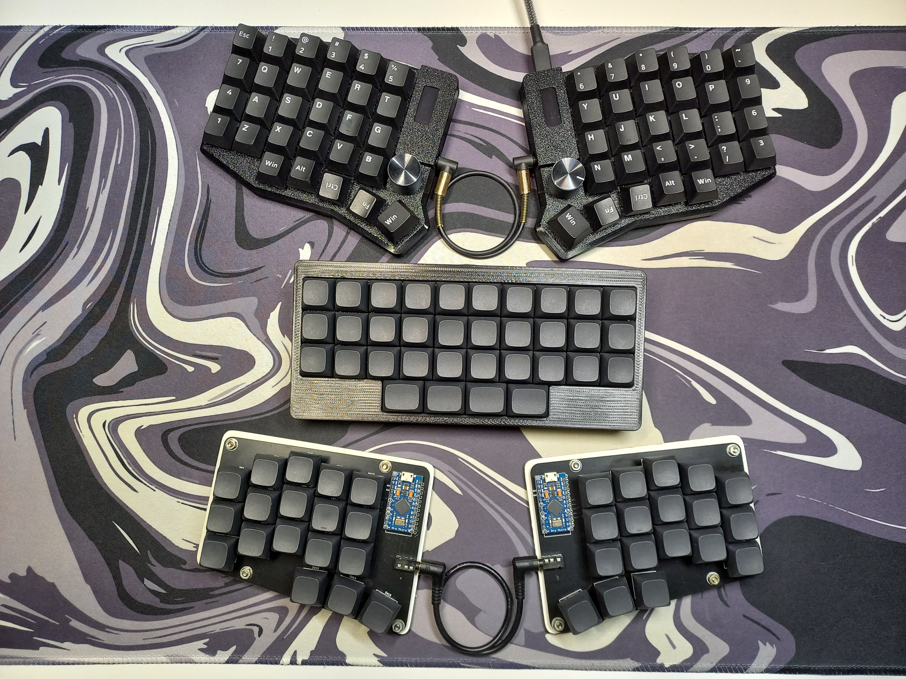

# My keyboards
All my keyboards, that i made.

## Keebs:
- [first-split36](https://github.com/Andrei-Kharitonov/Keyboards/tree/main/first-split36) - my first build 36 key split column staggered (pcb only).
- [monolith34](https://github.com/Andrei-Kharitonov/Keyboards/tree/main/monolith34) - 34 key 3d printed handwired ortholinear keyboard with unusual bottom row.
- [Sofle-rgb case](https://github.com/Andrei-Kharitonov/Keyboards/tree/main/Sofle-rgb) - 3d print case for Sofle rgb