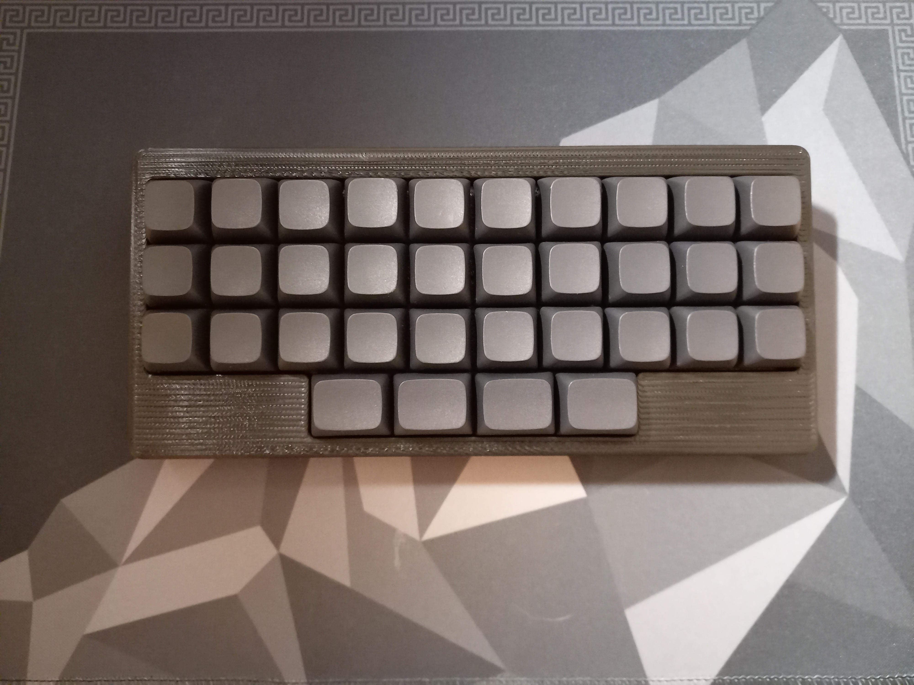
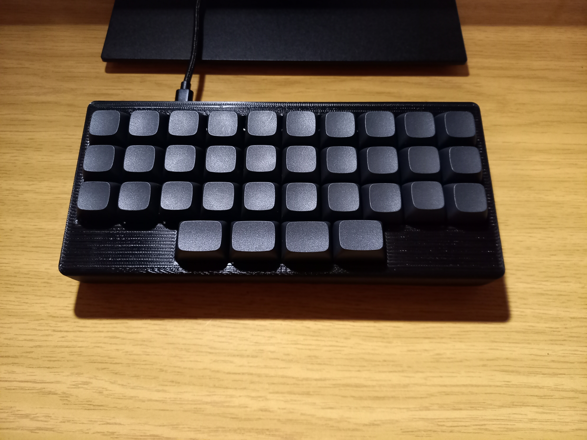
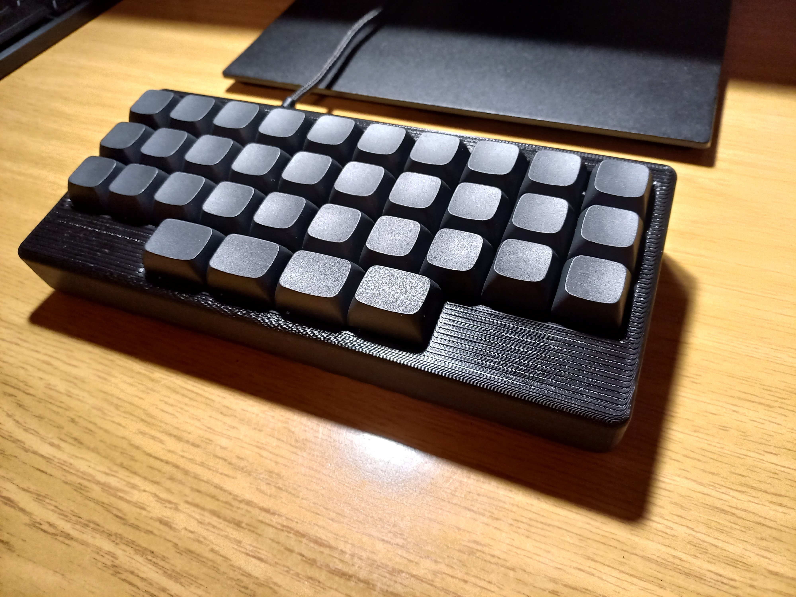
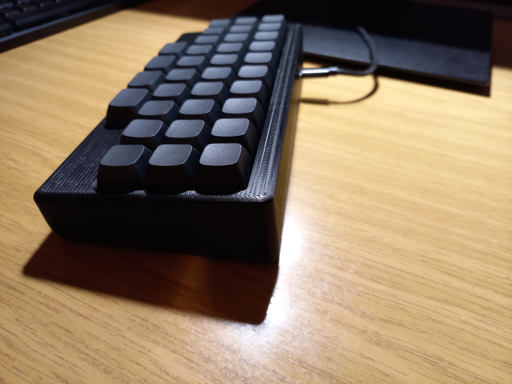

# Monolith34
34 key ortholinear 3d printed handwired keyboard. Use Pro Micro microcontroller.

## Photos

## Parts
- 1x Arduino Pro Micro (Atmega32U4)
- 34x cherry mx switches
- 34x diods
- 8x 2,5mm bolts
- rounded file